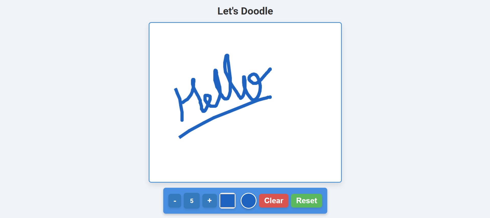

# Let's Doodle

Welcome to **Let's Doodle**, a fun and interactive drawing app built with HTML, CSS, and JavaScript.

## Features
- **Interactive Drawing**: Draw freely on the canvas with smooth, real-time rendering as you move the mouse.
- **Customizable Brush Size**: Use the `+` and `-` buttons to increase or decrease the brush size, ranging from 5px to 50px.
- **Color Picker**: Select any color for your drawing, using the built-in color picker.
- **Clear Canvas**: Press the **Clear** button to erase everything on the canvas.
- **Reset**: Press the **Reset** button to start fresh with default settings (resetting size and color).

## Screenshot
  
*It looks like this* – The interface features a canvas where you can freely draw, choose colors, adjust brush sizes, and clear or reset the drawing area.

## How It Works
1. **Drawing**: Click and hold your mouse to draw. The app tracks the mouse movement and draws accordingly based on the current settings (brush size and color).
2. **Adjust Brush Size**: Use the **+** and **-** buttons to change the size of your drawing strokes. The size will be displayed on-screen.
3. **Change Color**: Pick any color from the color picker to customize the drawing color.
4. **Clear Canvas**: Click the **Clear** button to remove everything drawn on the canvas.
5. **Reset**: Click the **Reset** button to clear the canvas and reset all settings to their initial state.

## Future Enhancements
Here are some ideas for future enhancements:
- **Save Drawings**: Allow users to save their creations as images (PNG or JPG).
- **Undo/Redo**: Implement an undo/redo functionality to reverse drawing actions.
- **Drawing Tools**: Add more tools such as shapes (circle, square), freehand curves, or text.
- **Mobile Touch Support**: Improve the app for mobile users by supporting touch events for drawing.
- **Brush Effects**: Introduce different brush styles like dashed lines, dotted lines, or texture brushes.
- **Eraser Tool**: Implement an eraser tool that allows users to remove parts of the drawing.

## Contribution
We welcome contributions! If you'd like to help improve **Let's Doodle**, here’s how you can get started:
1. **Fork** the repository.
2. **Create** a new branch to work on.
3. **Make** your changes and commit them.
4. **Submit** a pull request with a description of what you’ve done.

You can contribute by:
- Adding new features (e.g., new drawing tools or shapes)
- Fixing bugs
- Improving the user interface (UI) or experience (UX)

---
Let's Doodle Together!!
